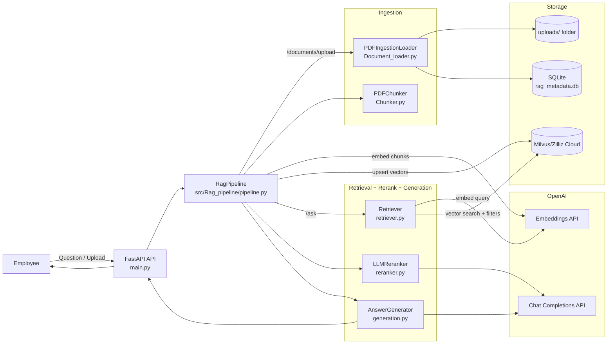

# Classic RAG Knowledge Assistant (PDF + Milvus + OpenAI)

This document explains the architecture and end-to-end data flow of the Classic RAG pipeline implemented in this repository.
The system is designed to answer employee questions using **only** the company's internal PDFs.

## 1. High-Level Goals

- Ingest internal PDFs (HR, Engineering, Guides, Manuals)
- Chunk and embed content
- Store embeddings + metadata in a vector database (Milvus / Zilliz Cloud)
- Retrieve Top-K chunks for a user question
- Rerank retrieved chunks for better relevance
- Generate a grounded final answer with citations
- Support document lifecycle (active/latest) + versioning + namespaces for isolation

## 2. System Components (Code-Level)

| Layer | Component | File | Why it exists |
|---|---|---|---|
| API | FastAPI app | `main.py` | Exposes `/documents/upload` and `/ask` endpoints |
| Orchestration | Pipeline | `src/Rag_pipeline/pipeline.py` | Connects ingestion -> embedding -> vector store and retrieval -> rerank -> generation |
| Config | Environment config | `src/Rag_pipeline/config.py` | Central place for models, chunking, retrieval, Milvus settings |
| Ingestion | PDF loader + lifecycle DB | `src/Rag_pipeline/ingestion/Document_loader.py` | Saves uploads, extracts text/pages, dedupe, versioning, SQLite metadata |
| Ingestion | Chunking | `src/Rag_pipeline/ingestion/Chunker.py` | Produces chunk windows; page-aware chunks are used for citations |
| Embeddings | OpenAI embedding wrapper | `src/Rag_pipeline/Embedding/openai_embedding.py` | Converts chunks/questions into vectors |
| Vector DB | Milvus store | `src/Rag_pipeline/vectordbstorage/milvustore.py` | Creates collection schema, upserts vectors+metadata, performs filtered search |
| Retrieval | Retriever | `src/Rag_pipeline/retrieval/retriever.py` | Embeds question and calls Milvus search (Top-K) |
| Rerank | LLM reranker | `src/Rag_pipeline/Generation/reranker.py` | Re-orders retrieved chunks by "answer usefulness" |
| Generation | Answer generator | `src/Rag_pipeline/Generation/generation.py` | Builds context + asks LLM for grounded answer with inline citations |

## 3. Overall Architecture Diagram (UML-Style)

Below is a UML-style component/flow diagram (Mermaid). The PDF submission includes the same diagram rendered cleanly.

## 4. End-to-End Data Flow

### 4.1 Upload Flow: `/documents/upload`

| Step | Layer | Component / File | What happens |
|---|---|---|---|
| 1 | API | `POST /documents/upload` (`main.py`) | Receives PDF bytes + form fields (`user_id`, `org_id`, `scope`, optional `team_id`, optional `doc_key`). Validates the file type, then calls the pipeline ingestion method. |
| 2 | Orchestration | `RagPipeline.ingest_pdf_upload(...)` (`src/Rag_pipeline/pipeline.py`) | Orchestrates ingestion + indexing: loader (dedupe/versioning) -> page-aware chunking -> embeddings -> Milvus upsert. |
| 3 | Ingestion | `PDFIngestionLoader.ingest_pdf(...)` (`src/Rag_pipeline/ingestion/Document_loader.py`) | Derives the `namespace`, saves the PDF to `uploads/<namespace>/uuid_filename.pdf`, extracts per-page text (`pypdf`), normalizes text, and computes `sha256`. |
| 4 | Lifecycle + Versioning | SQLite writes (`rag_metadata.db`) via `Document_loader.py` | Deduplicates by (`namespace`, `checksum_sha256`). Creates/updates `(namespace, doc_key)` and inserts a new `version_id`. Marks older versions `is_latest=0`. Stores chunks into `document_chunks`. |
| 5 | Chunking | `PDFChunker.chunk_loaded_pdf(...)` (`src/Rag_pipeline/ingestion/Chunker.py`) | Splits text page-by-page into overlapping chunks and preserves page numbers for accurate citations. |
| 6 | Embedding | `OpenAIEmbedder.embed_chunks(...)` (`src/Rag_pipeline/Embedding/openai_embedding.py`) | Calls OpenAI Embeddings API to convert chunk text into vectors. |
| 7 | Vector DB | `MilvusStore.upsert_chunks(...)` (`src/Rag_pipeline/vectordbstorage/milvustore.py`) | Upserts `embedding` + `text` + metadata (`namespace`, `doc_id`, `version_id`, `page`, `lifecycle`, `is_latest`, `checksum_sha256`) into Milvus. |

### 4.2 Ask Flow: `/ask`

`/ask` takes only a `question`. The API selects a namespace internally (`DEFAULT_NAMESPACE` if set, otherwise the latest indexed namespace from SQLite).

| Step | Layer | Component / File | What happens |
|---|---|---|---|
| 1 | API | `POST /ask` (`main.py`) | Receives the user question and selects a namespace for retrieval. |
| 2 | Orchestration | `RagPipeline.ask(...)` (`src/Rag_pipeline/pipeline.py`) | Runs retrieve -> rerank -> generate. |
| 3 | Retrieval | `Retriever.retrieve(...)` (`src/Rag_pipeline/retrieval/retriever.py`) | Embeds the question and calls Milvus Top-K search. |
| 4 | Vector DB | `MilvusStore.search(...)` (`src/Rag_pipeline/vectordbstorage/milvustore.py`) | Cosine similarity search with filters: `namespace`, `lifecycle == "ACTIVE"`, `is_latest == true`. Returns chunk text + page + ids + scores. |
| 5 | Rerank | `LLMReranker.rerank(...)` (`src/Rag_pipeline/Generation/reranker.py`) | LLM reorders retrieved chunks by "answer usefulness" using strict JSON output. Safe fallback keeps stable ordering if model output is invalid. |
| 6 | Generation | `AnswerGenerator.generate(...)` (`src/Rag_pipeline/Generation/generation.py`) | Builds context blocks `[S#]` with page numbers and generates a grounded answer with inline citations. |
| 7 | Response shaping | `main.py` + `Document_loader.get_version_source(...)` | Returns `answer` + `sources` (deduped source + page list). No separate `Sources:` block inside the answer. |

## 5. Embeddings

- Chunk embeddings: created in `OpenAIEmbedder.embed_chunks(...)`
- Query embeddings: created in `OpenAIEmbedder.embed_query(...)`
- The embedding dimension is configured via `EMBED_DIM` in `.env` and used to create the Milvus schema.

## 6. Retrieval (Top-K)

Retrieval is classic vector similarity:

- Embed the question -> query vector
- `MilvusStore.search(...)` performs `COSINE` similarity search using Milvus `AUTOINDEX`
- Returns Top-K chunks with their similarity scores and metadata

Namespace + lifecycle filters prevent cross-tenant leakage and keep retrieval limited to active/latest content.

## 7. Reranking

Reranking happens after vector search and before final generation:

- File: `src/Rag_pipeline/Generation/reranker.py`
- Input: question + retrieved chunks
- Output: reordered list (Top-N) more likely to directly answer the question

This is the classic improvement: vector search finds related text; rerank prioritizes answering text.

## 8. Generation (Grounded Answer)

- File: `src/Rag_pipeline/Generation/generation.py`
 - File: `src/Rag_pipeline/Generation/generation.py`
 - Context is built from retrieved chunks and labeled with chunk identifiers.
   Each context block is prefixed with a chunk citation token of the form
   `[C:<doc_id>:<chunk_pk>]` (for example: `[C:doc123:doc123:v1:0]`). The generator
   uses these chunk tokens for in-answer citations.
 - The system prompt enforces:
   - use only the provided context
   - cite only by chunk id tokens (e.g. `[C:doc123:doc123:v1:0]`) — no S# tokens
   - do not include a free-form `Sources:` block inside the answer (the API returns
     a separate `sources` structure mapping chunk ids to doc/page metadata)

## 9. Document Lifecycle, Namespace Isolation, Version Strategy

### 9.1 Namespace / Tenant Isolation

Namespace is derived in `PDFIngestionLoader._derive_namespace(...)`:

- `scope=private` -> `org:<org_id>:user:<user_id>`
- `scope=team` -> `org:<org_id>:team:<team_id>`
- `scope=org` -> `org:<org_id>:public`

The namespace is stored in SQLite and in Milvus for each chunk, and used as a filter at retrieval time.

### 9.2 Document Lifecycle

SQLite tables include `status` fields:
- `documents.status`: ACTIVE/ARCHIVED/DELETED
- `document_versions.status`: ACTIVE/ARCHIVED/DELETED

Milvus rows store:
- `lifecycle`: ACTIVE/ARCHIVED/DELETED
- `is_latest`: boolean

Current retrieval uses `lifecycle == "ACTIVE"` and `is_latest == true`.

### 9.3 Version / Update Strategy

- A logical document is identified by `(namespace, doc_key)`
- Uploading the same `doc_key` creates a new `version_id`
- SQLite marks older versions as `is_latest=0`
- Duplicate detection: same `checksum_sha256` within the same namespace returns `DUPLICATE` and skips re-indexing

Note: If you need strict "latest-only" behavior in Milvus too, you can:
- update old vectors `is_latest=false` before upserting new vectors, or
- delete old vectors for that doc/version.

## 10. How To Run End-to-End

### 10.1 Configure

Create `.env` from `.env.example` and fill:

- `OPENAI_API_KEY`
- `MILVUS_URI`, `MILVUS_TOKEN`
- `MILVUS_COLLECTION` (use a new collection name if schema mismatch)

Run and usage commands are intentionally kept in `README.md` to keep this architecture document implementation-focused.
